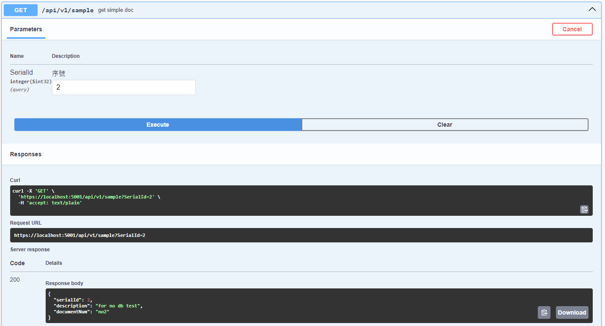
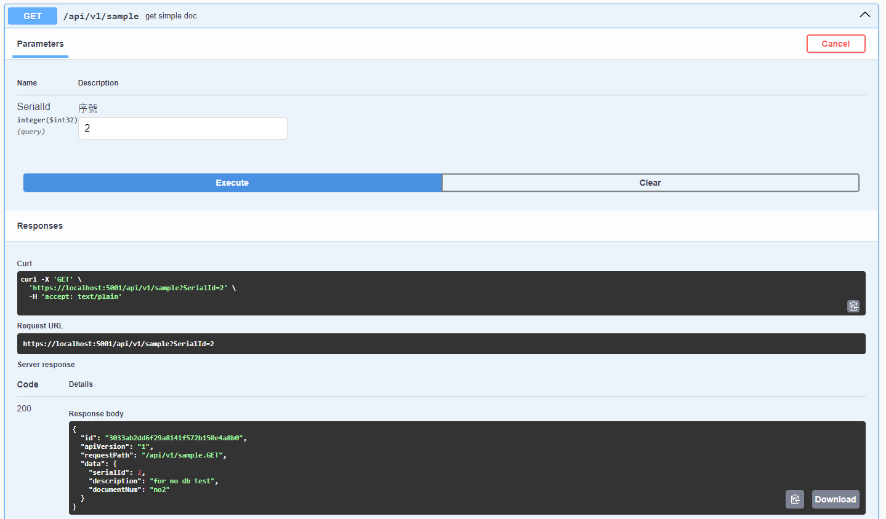
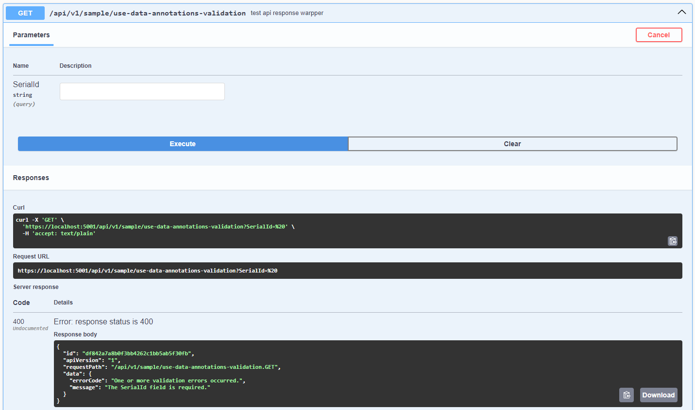
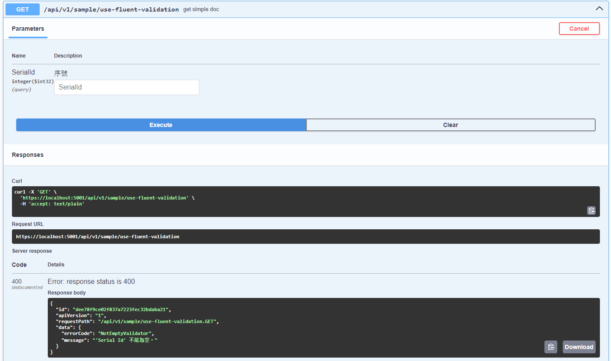

# 幫 AspNetCore WebApi 包上自己的 response model，Part 1 : 包裝 api 回應


在實作 web api 時，通常都會另外處理自己系統專屬的回應物件，我在前一份工作中因為已經有底層的前輩建立好相關的處理套件，所以一直以來都沒特別研究怎麼包裝以及自訂回應欄位。

最近在自己的練習專案中嘗試去實作這樣的機制才發現原來要考慮的東西有點多，這邊我就來分享一下我的做法以及其他可以用的方式與用途。

<!--more-->


以下內容使用 dotnet 8 的 AspNetCore WebApi 進行測試與開發，相關範例程式碼可以在我的 [github repo](https://github.com/YuChia-Wei/dotnet-webapi-lab) 找到，但是這個 repo 包含了我許多練習用的程式碼，可能會有點混亂，還請海涵


## 定義回應物件

### 標準回應格式

既然要建立標準的 api 回應格式，當然是要先準備相關的回應物件。

首先，我們會需要一個 id 來記載這次回應的唯一碼以便支援與追蹤。

除了 id 外，我們可能也會需要紀錄此次 api request 的 api version, request path 等資訊，但由於 api version 通常會設計在 api request path 之上，而 request path 調用的人一定會知道，所以這兩個資訊通常可以忽略，可依據需求選擇是否加入。

實際回應的資料部分，為了讓物件的泛用性更高，選擇泛型來定義資料屬性讓這個回應格式可以相容絕大多數的情境。

```csharp
/// <summary>
/// 標準 api 回應
/// </summary>
/// <typeparam name="T"></typeparam>
public class ApiResponse<T>
{
    /// <summary>
    /// api 的追蹤編號
    /// </summary>
    public string Id { get; set; }

    /// <summary>
    /// api version
    /// </summary>
    public string ApiVersion { get; set; }

    /// <summary>
    /// api request path
    /// </summary>
    public string RequestPath { get; set; }

    /// <summary>
    /// 回應資料
    /// </summary>
    public T Data { get; set; }
}
```

### 錯誤資訊物件

定義好我們 api 要用的標準回應之後，我們還可以另外準備一個專門用於包裝錯誤資訊的物件，以便我們在系統發生錯誤或者需要自訂回應資訊時另外包裝資料。

通常在建立系統時，為了明確定義錯誤是什麼，在系統設計時都會定義一系列的錯誤碼來告知前端開發人員或 api 使用者我們系統出現了什麼問題，所以這邊我們定義了 'ErrorCode' 屬性來記載錯誤編號

然後，我們可能會另外需要 'Message' 與 'Description' 兩個資訊來分別紀錄「錯誤訊息」與「錯誤詳細資料」。

```csharp
/// <summary>
/// api error information
/// </summary>
public class ApiErrorInformation
{
    /// <summary>
    /// 錯誤編號
    /// </summary>
    public string ErrorCode { get; set; }

    /// <summary>
    /// 錯誤訊息
    /// </summary>
    public string Message { get; set; }

    /// <summary>
    /// 錯誤詳細說明
    /// </summary>
    [JsonIgnore(Condition = JsonIgnoreCondition.WhenWritingNull)]
    public string Description { get; set; }
}
```

## 建立 IResultFilter 處理物件包裝

接下來，使用 IResultFilter 來設定系統該如何處理回應物件。

這邊是一個空的 IResultFilter，後面會依據各小節主題持續補充它。

```csharp
public class SuccessApiResponseWrappingFilter : IResultFilter
{
    /// <summary>Called before the action result executes.</summary>
    /// <param name="context">The <see cref="T:Microsoft.AspNetCore.Mvc.Filters.ResultExecutingContext" />.</param>
    public void OnResultExecuting(ResultExecutingContext context)
    {
        throw new NotImplementedException();
    }

    /// <summary>Called after the action result executes.</summary>
    /// <param name="context">The <see cref="T:Microsoft.AspNetCore.Mvc.Filters.ResultExecutedContext" />.</param>
    public void OnResultExecuted(ResultExecutedContext context)
    {
        throw new NotImplementedException();
    }
}
```

### 避開圖片與大型檔案等回應的包裝

當 api 回應的資料是圖片或其他二進位資料時，並不需要去另外包裝為團隊所需的回應格式，因此在自訂的 IResultFilter 中要增加相對應的判斷來避開這個狀況。

在回應圖片或其他二進位資料時，Controller 可能會這樣設定

```csharp
[HttpGet]
public IActionResult GetImage()
{
    var imagePath = "path_to_image.png";
    var fileBytes = System.IO.File.ReadAllBytes(imagePath);
    return File(fileBytes, "image/png");
}
```

在這個 api method 中，使用了 File() 來回傳資料，所以在 IResultFilter 中的 context.Result 物件型別會是 FileResult，因此可以判斷 Result 是否為 FileResult 來避開

```csharp
if (context.Result is FileResult)
{
    return;
}
```

如果要謹慎一點的話，還可以加上資料類型的判斷來避免 context.Result 不是 FileResult 的情境

```csharp
if (context.Result is FileResult ||
    context.HttpContext.Response.ContentType?.StartsWith("image/") == true ||
    context.HttpContext.Response.ContentType == "application/octet-stream")
{
    return;
}
```

### 包裝有效回應

#### 辨別是否為 200 成功回應

如果 Controller 中的 api method 用以下的方式撰寫時，回應的物件分別會是 'OkObjectResult' 、 'ObjectResult' 兩種

```csharp
[HttpGet("action-result")]
public async Task<IActionResult> GetActionResult()
{
    return Ok("Hello World");
}

[HttpGet("object")]
public async Task<object> GetObject()
{
    return "Hello World";
}
```

這時候，可以利用以下的判斷來讓 ResultFilter 針對有效回應進行包裝物件；由於我想要自己另外處理錯誤相關的回應，所以這邊是針對 200 的回應來進行包裝，後續會再另外撰寫錯誤資料的包裝行為。

> 這邊的判斷方法會將轉型好的 ObjectResult 回傳給調用端，讓調用端可以用來設定資料

```csharp
private static bool TryGetSuccessResultData(ResultExecutingContext context, out ObjectResult successObjectResult)
{
    switch (context.Result)
    {
        case OkObjectResult okResult:
            successObjectResult = okResult;
            return true;
        case ObjectResult { StatusCode: >= 200 and < 300 } objectResult:
            successObjectResult = objectResult;
            return true;
        default:
            successObjectResult = context.Result;
            return false;
    }
}
```

#### 包裝回應物件

接下來就是實際的物件包裝了，因為前面已經拿到了有效的回應物件，所以這邊的設定就會比較簡單，就只是把 ApiResponse 物件建立起來並設定回去而已。

這邊會比較注意的是，要思考 ApiResponse 中的 Id 欄位要塞入的資料是什麼，在現在可觀測性概念盛行的環境下，我選擇直接使用 Trace Id 來作為我的 Response Id，至於實際上應該要用什麼資料作為 Id 可以由團隊成員一起定義，並且配合資安考量進行處理。

另外，雖然這邊的 successObjectResult 可能為 null，但是我在 TryGetSuccessResultData 中的處理是如果不成功就會是 false，所以並不會進入這個 if 內進行處理，所以我選擇忽略這個問題。

```csharp
if (TryGetSuccessResultData(context, out var successObjectResult))
{
    // 從 http header request 中檢查有沒有 trace id
    // var traceId = context.HttpContext.Request.Headers["X-Trace-Id"].ToString() ?? "no-trace-id";

    // 利用 dotnet 的 Activity 來取得 trace id
    var traceId = Activity.Current?.TraceId.ToString() ?? Guid.NewGuid().ToString();

    var wrappedResponse = new ApiResponse<object?>
    {
        Id = traceId,
        ApiVersion = context.HttpContext.ApiVersioningFeature().RawRequestedApiVersion,
        RequestPath = $"{context.HttpContext.Request.Path}.{context.HttpContext.Request.Method}",
        Data = successObjectResult?.Value
    };

    context.Result = new ObjectResult(wrappedResponse)
    {
        Formatters = successObjectResult?.Formatters,
        ContentTypes = successObjectResult?.ContentTypes,
        StatusCode = successObjectResult?.StatusCode,
        DeclaredType = successObjectResult?.DeclaredType,
    };
}
```

#### 包裝成品比對

- before
    
- after
    

### 處理錯誤回應

前面處理完了成功的回應後，接下來接著處理錯誤的回應。

#### 辨別是否為 400 錯誤回應

為了針對錯誤要求進行包裝，這邊一樣使用一個判斷方法來辨別是否為 BadRequestResult

```csharp
private static bool TryGetBadRequestResultData(ResultExecutingContext context, out BadRequestResult? badRequestResult)
{
    if (context.Result is BadRequestResult result)
    {
        badRequestResult = result;
        return true;
    }

    badRequestResult = null;
    return false;
}
```

#### 包裝回應物件

接著來處理回應物件包裝的部分，這邊會需要注意的點是，開發團隊可能使用 FluentValidation 進行物件驗證，也可能使用內建的 DataAnnotations 進行驗證，兩邊回應的物件不一樣，所以會需要注意物件轉換時所使用的物件。

先將 FluentValidation 跟 DataAnnotations 的錯誤物件轉為前面定義的共用錯誤物件 'ApiErrorInformation'，這邊的範例程式碼的設定方式僅用於示意，實際的設定方法應與團隊協議好物件該怎麼定義資料。


當然，如果團隊有共識可以直接使用原本的錯誤物件輸出也是沒有問題的，完全就是團隊在系統設計上的決策問題~

如果要使用原本的錯誤物件，做法就跟前面成功要求的做法一樣，直接把回應資料包起來就好，不用特別處理。


```csharp
var apiErrorInformation = new ApiErrorInformation();
switch (badRequestObjectResult.Value)
{
    // FluentValidation 的錯誤物件
    case List<ValidationFailure> validationFailures:
        apiErrorInformation.ErrorCode = validationFailures.First().ErrorCode;
        apiErrorInformation.Message = validationFailures.First().ErrorMessage;
        break;

    // DataAnnotations 的錯誤物件
    case ValidationProblemDetails validationProblemDetails:
        apiErrorInformation.ErrorCode = validationProblemDetails.Title;
        // 這邊需要額外進入 values 裡面才能取得真的要的錯誤訊息
        apiErrorInformation.Message = validationProblemDetails.Errors.Values.FirstOrDefault().FirstOrDefault();
        break;
}
```

再來跟前面成功的回應一樣，設定 Result

```csharp
var traceId = Activity.Current?.TraceId.ToString() ?? Guid.NewGuid().ToString();

var wrappedResponse = new ApiResponse<ApiErrorInformation>
{
    Id = traceId,
    ApiVersion = context.HttpContext.ApiVersioningFeature().RawRequestedApiVersion,
    RequestPath = $"{context.HttpContext.Request.Path}.{context.HttpContext.Request.Method}",
    Data = apiErrorInformation
};

context.Result = new BadRequestObjectResult(wrappedResponse)
{
    Formatters = badRequestObjectResult.Formatters,
    ContentTypes = badRequestObjectResult.ContentTypes,
    StatusCode = badRequestObjectResult.StatusCode,
    DeclaredType = badRequestObjectResult.DeclaredType
};
```

#### 包裝後成果

- use data annotations validation
    
- use fluent validation
    

### 完整的 Api Response Wrapping Filter

```csharp
/// <summary>
/// api 回應包裝器
/// </summary>
public class ApiResponseWrappingFilter : IResultFilter
{
    public void OnResultExecuting(ResultExecutingContext context)
    {
        if (IsBinaryResult(context))
        {
            return;
        }

        if (TryGetSuccessResultData(context, out var successObjectResult))
        {
            // var traceId = context.HttpContext.Request.Headers["X-Trace-Id"].ToString() ?? "no-trace-id";

            var traceId = Activity.Current?.TraceId.ToString() ?? Guid.NewGuid().ToString();

            var wrappedResponse = new ApiResponse<object?>
            {
                Id = traceId,
                ApiVersion = context.HttpContext.ApiVersioningFeature().RawRequestedApiVersion,
                RequestPath = $"{context.HttpContext.Request.Path}.{context.HttpContext.Request.Method}",
                Data = successObjectResult?.Value
            };

            context.Result = new ObjectResult(wrappedResponse)
            {
                Formatters = successObjectResult?.Formatters,
                ContentTypes = successObjectResult?.ContentTypes,
                StatusCode = successObjectResult?.StatusCode,
                DeclaredType = successObjectResult?.DeclaredType
            };
        }

        if (TryGetBadRequestObjectResultData(context, out var badRequestObjectResult))
        {
            var apiErrorInformation = new ApiErrorInformation();
            switch (badRequestObjectResult.Value)
            {
                // FluentValidation 的錯誤物件
                case List<ValidationFailure> validationFailures:
                    apiErrorInformation.ErrorCode = validationFailures.First().ErrorCode;
                    apiErrorInformation.Message = validationFailures.First().ErrorMessage;
                    break;

                // DataAnnotations 的錯誤物件
                case ValidationProblemDetails validationProblemDetails:
                    apiErrorInformation.ErrorCode = validationProblemDetails.Title;
                    // 這邊需要額外進入 values 裡面才能取得真的要的錯誤訊息
                    apiErrorInformation.Message = validationProblemDetails.Errors.Values.FirstOrDefault().FirstOrDefault();
                    break;

                case ApiErrorInformation apiError:
                    apiErrorInformation = apiError;
                    break;
            }

            var traceId = Activity.Current?.TraceId.ToString() ?? Guid.NewGuid().ToString();

            var wrappedResponse = new ApiResponse<ApiErrorInformation>
            {
                Id = traceId,
                ApiVersion = context.HttpContext.ApiVersioningFeature().RawRequestedApiVersion,
                RequestPath = $"{context.HttpContext.Request.Path}.{context.HttpContext.Request.Method}",
                Data = apiErrorInformation
            };

            context.Result = new BadRequestObjectResult(wrappedResponse)
            {
                Formatters = badRequestObjectResult.Formatters,
                ContentTypes = badRequestObjectResult.ContentTypes,
                StatusCode = badRequestObjectResult.StatusCode,
                DeclaredType = badRequestObjectResult.DeclaredType
            };
        }
    }

    public void OnResultExecuted(ResultExecutedContext context)
    {
        // 這裡可以加入在結果執行後的處理邏輯
    }

    private static bool IsBinaryResult(ResultExecutingContext context)
    {
        return context.Result is FileResult ||
               context.HttpContext.Response.ContentType?.StartsWith("image/") == true ||
               context.HttpContext.Response.ContentType == "application/octet-stream";
    }

    private static bool TryGetBadRequestObjectResultData(ResultExecutingContext context, out BadRequestObjectResult? badRequestResult)
    {
        if (context.Result is BadRequestObjectResult result)
        {
            badRequestResult = result;
            return true;
        }

        badRequestResult = null;
        return false;
    }

    private static bool TryGetSuccessResultData(ResultExecutingContext context, out ObjectResult? successObjectResult)
    {
        switch (context.Result)
        {
            case OkObjectResult okResult:
                successObjectResult = okResult;
                return true;
            case ObjectResult { StatusCode: >= 200 and < 300 } objectResult:
                successObjectResult = objectResult;
                return true;
            default:
                successObjectResult = null;
                return false;
        }
    }
}

```

### 補充資料 ActionFilter & ResultFilter

在前面可以看到我使用的是 IResultFilter 來包裝回應物件，這是因為 IResultFilter 是專門用來處理回應和修改 IActionResult 用的介面，他分別有 OnResultExecuting 與 OnResultExecuted 兩個方法，個別的職責如下

- OnResultExecuting
    在動作方法執行完並生成結果，但在結果被處理（例如序列化成 JSON 或其他格式）之前執行。
    你可以在這裡修改 ActionResult，或者執行額外的邏輯，譬如我們這邊做的包裝回應物件，又或者是手動調整 Http Status Code 等。

- OnResultExecuted
    在結果已經處理完，回應即將發送給客戶端之後執行。
    這個方法主要用於在結果已經準備發送給客戶端後做一些清理操作或記錄日誌。

詳細資料可以參考 [MS Learn](https://learn.microsoft.com/zh-tw/aspnet/core/mvc/controllers/filters?view=aspnetcore-8.0)

## 為 Controller 加上 IResultFilter

在完成了前面的物件準備後，當然就是要套用在系統上拉~

套用的方式很簡單，只需要在 program.cs 的 controller 設定裡加上去就好了，程式碼如下

```csharp
builder.Services.AddControllers(options =>
{
    options.Filters.Add<ApiResponseWrappingFilter>();
});
```

