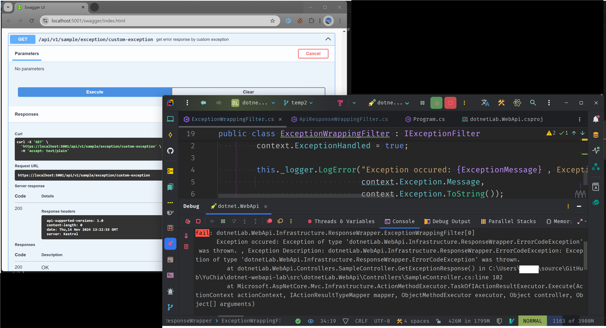
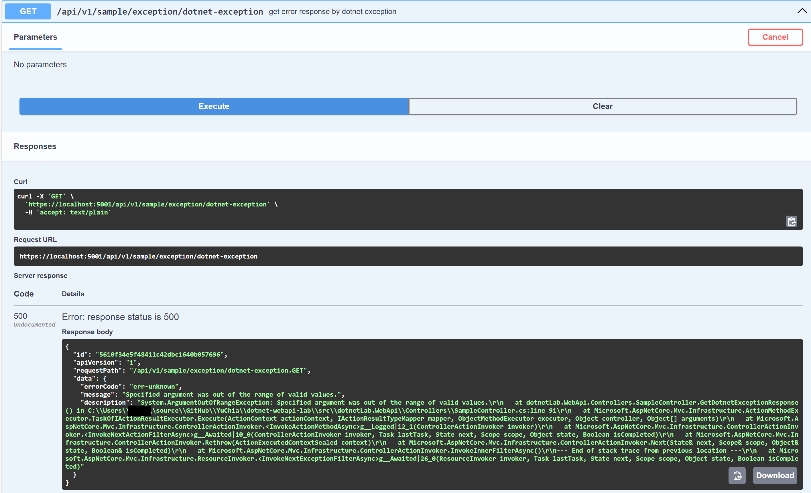
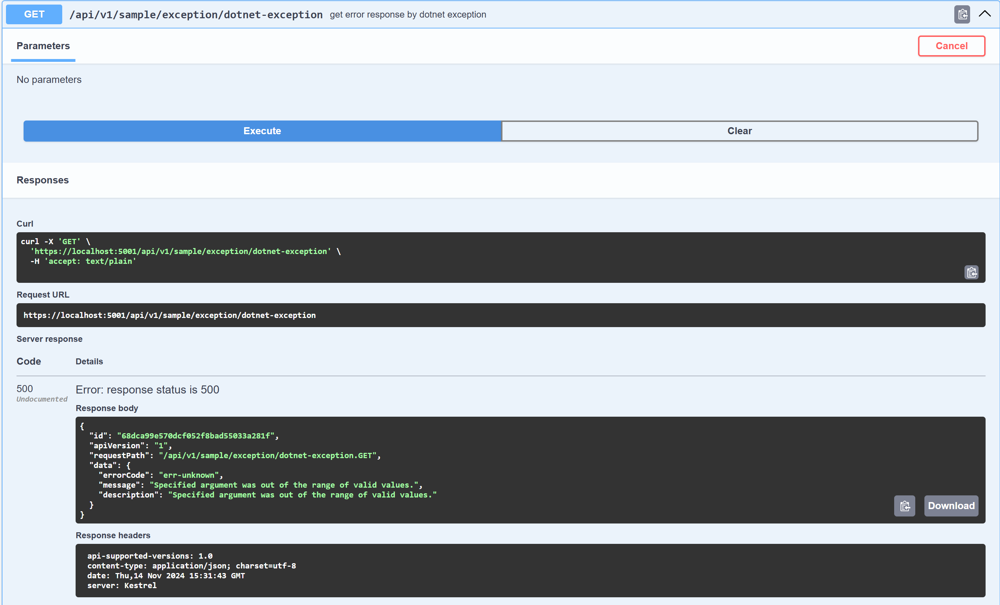
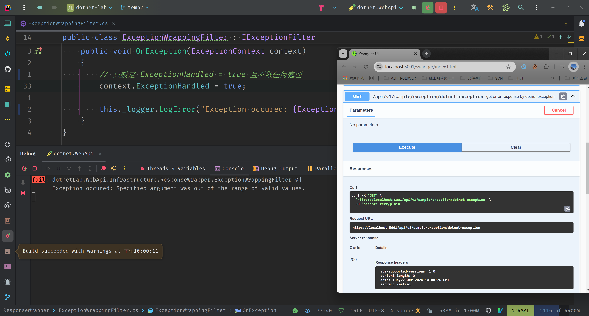
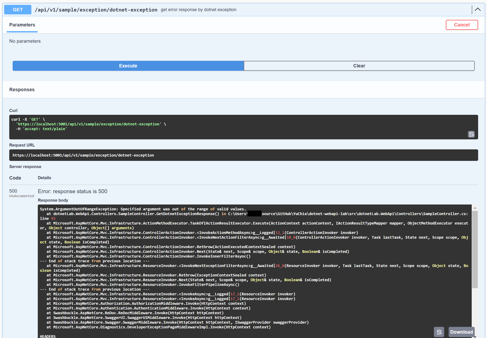
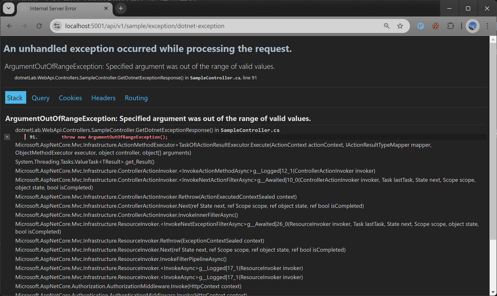

# 幫 AspNetCore WebApi 包上自己的 response model，Part 2 : 包裝例外


這篇為 「幫 AspNetCore WebApi 包上自己的 response model」 的第二部分 「包裝例外」。
</br>

我將介紹如何在 ASP.NET Core Web API 中統一處理例外狀況，並將其包裝成標準化的回應格式。

我會介紹以下兩種例外資料的包裝方法：

1. 使用 UseExceptionHandler Middleware
2. 使用 IExceptionFilter 介面

<!--more-->


以下內容使用 dotnet 8 的 AspNetCore WebApi 進行測試與開發，相關範例程式碼可以在我的 [github repo](https://github.com/YuChia-Wei/dotnet-webapi-lab) 找到，但是這個 repo 包含了我許多練習用的程式碼，可能會有點混亂，還請海涵
</br>
預計在近期會進行 dotnet 9 的版本更新，到時候會再更新相關的程式碼，並且會將 repo 中的程式碼進行整理。


## AspNetCore WebApi 的例外處理

在上一篇的介紹可以理解到，要處理 api 的回應資料時使用 ActionFilter 是最便捷的做法，那如果系統發生例外的話是不是也能用 ActionFilter 處理呢？答案是可以的。

在微軟的 ActionFilter 系列的介面中，有一個介面叫做 `IExceptionFilter`，這一個 ActionFilter 就是專職處理例外的工具，我們只要實作這個介面就可以建立一個專門處理 api 內部出現例外時該怎麼回應的 ActionFilter。


Filter 類別的執行順序可以查閱 [MS Learn](https://learn.microsoft.com/zh-tw/aspnet/core/mvc/controllers/filters?view=aspnetcore-8.0) ，這邊不另外說明。


不過，在開始之前我想先介紹另外一個較為暴力的例外處理機制 `UseExceptionHandler` 這個 middleware，並且利用這個 middleware 包裝例外回應資料。

### 使用 UseExceptionHandler 處理例外並包裝回應資料

UseExceptionHandler 這個 middleware 是在 dotnet 8 才開始支援的 middleware，這個 middleware 可以捕捉系統內的所有例外，並且自訂例外處理的行為，所以，自然也可以利用這個 middleware 來包裝回應資料。

關於其他自訂 UseExceptionHandler 這個 middleware 的細節可以在微軟的 [MS Learn - ASP.NET Core 錯誤處理](https://learn.microsoft.com/zh-tw/aspnet/core/fundamentals/error-handling?view=aspnetcore-8.0) 中可以查閱。

我這邊要用的方式是比較簡單的在 UserExceptionHandler 中直接用 lambda 設定處理方法，其他詳細說明可以參閱 [微軟官方說明連結](https://learn.microsoft.com/zh-tw/aspnet/core/fundamentals/error-handling?view=aspnetcore-8.0#exception-handler-lambda)。

#### 取得例外資訊

在 UseExceptionHandler 中，我們可以利用 `context.Features.Get<IExceptionHandlerPathFeature>();` 取得該次例外的資訊，這個資訊包含該次例外發生的路徑、例外資訊、例外物件等資訊。

這邊會要注意的是，`context.Features.Get<IExceptionHandlerPathFeature>();` 這個方法取出的 IExceptionHandlerPathFeature 可能為 null，所以這邊建議另外檢查一次，不過，因為是發生例外狀況才進入這個 middleware，理論上不會有取不到的狀況，所以，是否要檢查 null 端看個人。

```csharp
app.UseExceptionHandler(applicationBuilder =>
{
    applicationBuilder.Run(async context =>
    {
        // 取得 IExceptionHandlerPathFeature 的資料，以便後續針對例外內容進行處理
        var exceptionHandlerPathFeature = context.Features.Get<IExceptionHandlerPathFeature>();
        var exception = exceptionHandlerPathFeature?.Error;

        Console.Error.WriteLine("Exception occured: {ExceptionMessage} , Exception Description: {ExceptionDescription} ", exceptionMessage,
                        exception?.ToString());
    });
});
```

#### 取得注入物件

在 UseExceptionHandler 中，我們也可以利用 `context.RequestServices.GetRequiredService<T>();` 方法來取得已注入的物件，如 AutoMapper 的 IMapper，或是 ILogger 等，也可以拿來取得 IOption 中的自訂設定。

所以這邊我利用 `context.RequestServices.GetRequiredService<ILogger>();` 來取得 ILogger 物件，並且利用它來記錄例外資訊，替換掉前面我們在 console 中記錄例外資訊的做法。

```csharp
app.UseExceptionHandler(applicationBuilder =>
{
    applicationBuilder.Run(async context =>
    {
        // 取得 ILogger 以便另外撰寫日誌
        var logger = context.RequestServices.GetRequiredService<ILogger>();

        // 取得 IExceptionHandlerPathFeature 的資料，以便後續針對例外內容進行處理
        var exceptionHandlerPathFeature = context.Features.Get<IExceptionHandlerPathFeature>();
        var exception = exceptionHandlerPathFeature?.Error;

        logger.LogError("Exception occured: {ExceptionMessage} , Exception Description: {ExceptionDescription} ", exception?.Message,
                        exception?.ToString());
    });
});
```

#### 建立回應資料

利用 ILogger 紀錄好了錯誤後，我們接著來調整回應資料。

首先，我們要使用在前一章節中建立的 `ApiResponse<T>` 物件來建立標準化的回應資料，並且使用 `ApiErrorInformation` 這個物件來作為我們的錯誤回應內容，以下是範例程式碼：

`ApiErrorInformation` 中的 `ErrorCode` 這個屬性，所以這邊我們先定義一個錯誤代碼 `err-unknown` 來作為錯誤的代碼。

另外，`ApiResponse<T>` 中的 `Id` 這個屬性，也與 [第一部分](../part1-response-wrapping/) 一樣，是利用 `Activity.Current?.TraceId.ToString()` 來取得該次錯誤的追蹤編號，並且設定到 `Id` 這個屬性中。

```csharp
app.UseExceptionHandler(applicationBuilder =>
{
    applicationBuilder.Run(async context =>
    {
        // 取得 ILogger 以便另外撰寫日誌
        var logger = context.RequestServices.GetRequiredService<ILogger>();

        // 取得 IExceptionHandlerPathFeature 的資料，以便後續針對例外內容進行處理
        var exceptionHandlerPathFeature = context.Features.Get<IExceptionHandlerPathFeature>();
        var exception = exceptionHandlerPathFeature?.Error;

        logger.LogError("Exception occured: {ExceptionMessage} , Exception Description: {ExceptionDescription} ", exception?.Message,
                        exception?.ToString());

        // 建立包含錯誤資訊的 api response 物件
        var failResultViewModel = new ApiResponse<ApiErrorInformation>
        {
            Id = Activity.Current?.TraceId.ToString() ?? Guid.NewGuid().ToString(),
            ApiVersion = context.ApiVersioningFeature().RawRequestedApiVersion,
            RequestPath = $"{context.Request.Path}.{context.Request.Method}",

            Data = new ApiErrorInformation
            {
                ErrorCode = "err-unknown",
                Message = exception?.Message,
                Description = exception?.ToString()
            }
        };

        await context.Response.WriteAsJsonAsync(failResultViewModel);
    });
});
```

#### 例外資訊的安全性考量

在前面章節我們在設定 ApiErrorInformation 的 `Description` 屬性時，我們是直接使用 `exception?.ToString()` 來取得例外資訊，這樣做雖然可以取得較完整的例外資訊，但是，這樣的作法會將系統的實作細節暴露給調用端，這樣的作法在正式環境中是絕對不被允許的。

所以，在這邊我們可以利用 `app.Environment.IsProduction()` 這個屬性來判斷目前系統的運作環境並且 api 要回傳的資訊，避免揭露不應該暴露的資訊。

```csharp
app.UseExceptionHandler(applicationBuilder =>
{
    applicationBuilder.Run(async context =>
    {
        // 取得 ILogger 以便另外撰寫日誌
        var logger = context.RequestServices.GetRequiredService<ILogger>();

        // 取得 IExceptionHandlerPathFeature 的資料，以便後續針對例外內容進行處理
        var exceptionHandlerPathFeature = context.Features.Get<IExceptionHandlerPathFeature>();
        var exception = exceptionHandlerPathFeature?.Error;

        logger.LogError("Exception occured: {ExceptionMessage} , Exception Description: {ExceptionDescription} ", exception?.Message,
                        exception?.ToString());

        var isProduction = app.Environment.IsProduction();

        // 建立包含錯誤資訊的 api response 物件
        var failResultViewModel = new ApiResponse<ApiErrorInformation>
        {
            Id = Activity.Current?.TraceId.ToString() ?? Guid.NewGuid().ToString(),
            ApiVersion = context.ApiVersioningFeature().RawRequestedApiVersion,
            RequestPath = $"{context.Request.Path}.{context.Request.Method}",

            Data = new ApiErrorInformation
            {
                ErrorCode = "err-unknown",
                Message = exception?.Message,
                Description = isProduction ? string.Empty : exception?.ToString()
            }
        };

        await context.Response.WriteAsJsonAsync(failResultViewModel);
    });
});

```

#### 完整程式碼

```csharp
// 其他程式碼省略

var app = builder.Build();

// Configure the HTTP request pipeline.
if (app.Environment.IsDevelopment())
{
    app.UseDeveloperExceptionPage();
}

//使用自訂物件樣式回應例外訊息
//這邊的例外捕捉是捕捉整個系統的，可以避免其他系統的例外洩露出去
app.UseExceptionHandler(applicationBuilder =>
{
    applicationBuilder.Run(async context =>
    {
        // 取得 ILogger 以便另外撰寫日誌
        var logger = context.RequestServices.GetRequiredService<ILogger>();

        // 取得 IExceptionHandlerPathFeature 的資料，以便後續針對例外內容進行處理
        var exceptionHandlerPathFeature = context.Features.Get<IExceptionHandlerPathFeature>();
        var exception = exceptionHandlerPathFeature?.Error;

        logger.LogError("Exception occured: {ExceptionMessage} , Exception Description: {ExceptionDescription} ", exception?.Message,
                        exception?.ToString());

        // 建立包含錯誤資訊的 api response 物件
        var failResultViewModel = new ApiResponse<ApiErrorInformation>
        {
            Id = Activity.Current?.TraceId.ToString() ?? Guid.NewGuid().ToString(),
            ApiVersion = context.ApiVersioningFeature().RawRequestedApiVersion,
            RequestPath = $"{context.Request.Path}.{context.Request.Method}",

            Data = new ApiErrorInformation
            {
                ErrorCode = "err-unknown",
                Message = exceptionMessage,
                Description = errorDescription
            }
        };

        await context.Response.WriteAsJsonAsync(failResultViewModel);
    });
});

// 其他程式碼省略
```

### 使用 IExceptionFilter 處理例外回應

接下來，讓我們來看看如何使用 `IExceptionFilter` 來捕捉 api 的例外並且設定回應資料。

#### ExceptionHandled

當系統發生例外後，如果在程式中都沒有使用 try-catch 捕捉例外，那麼就會進入 IExceptionFilter 以便我們統一處理。

所以，我們需要將 `ExceptionHandled` 這個屬性設定為 `true`，來標記例外已經被處理，避免這個例外進入我們前面提過的 `UseExceptionHandler` 這個 middleware 之中。

以下範例是我利用 `ExceptionHandled` 這個屬性來標記例外已經被處理，並且利用 `ILogger` 來記錄例外資訊。

```csharp
public class ExceptionWrappingFilter : IExceptionFilter
{
    private readonly ILogger<ExceptionWrappingFilter> _logger;

    /// <summary>
    /// ctor
    /// </summary>
    /// <param name="logger"></param>
    public ExceptionWrappingFilter(ILogger<ExceptionWrappingFilter> logger)
    {
        this._logger = logger;
    }

    /// <summary>
    /// Called after an action has thrown an <see cref="T:System.Exception" />.
    /// </summary>
    /// <param name="context">The <see cref="T:Microsoft.AspNetCore.Mvc.Filters.ExceptionContext" />.</param>
    public void OnException(ExceptionContext context)
    {
        context.ExceptionHandled = true;

        this._logger.LogError("Exception occured: {ExceptionMessage} , Exception Description: {ExceptionDescription} ",
                              context.Exception.Message,
                              context.Exception.ToString());
    }
}
```

這樣，我們就可以在 api 發生例外時，讓 api 回應 200 並在 console 看到例外資訊，像是下圖的結果。



#### 建立回應資料

設定好 `ExceptionHandled` 後，我們來開始調整回應資料，讓 api 的回應內容可以符合我們定義的標準格式。

同樣的，我們可以參考 [第一部分](../part1-response-wrapping/) 中的做法來建立回應資料，並且將建立好的資料設定到 `context.Result` 之中，這樣我們就可以讓 api 的回應內容符合我們定義的標準格式。

```csharp
public class ExceptionWrappingFilter : IExceptionFilter
{
    private readonly ILogger<ExceptionWrappingFilter> _logger;

    /// <summary>
    /// ctor
    /// </summary>
    /// <param name="logger"></param>
    public ExceptionWrappingFilter(ILogger<ExceptionWrappingFilter> logger)
    {
        this._logger = logger;
    }

    /// <summary>
    /// Called after an action has thrown an <see cref="T:System.Exception" />.
    /// </summary>
    /// <param name="context">The <see cref="T:Microsoft.AspNetCore.Mvc.Filters.ExceptionContext" />.</param>
    public void OnException(ExceptionContext context)
    {
        context.ExceptionHandled = true;

        this._logger.LogError("Exception occured: {ExceptionMessage} , Exception Description: {ExceptionDescription} ",
                              context.Exception.Message,
                              context.Exception.ToString());

        var failResultViewModel = new ApiResponse<ApiErrorInformation>
        {
            // 取得該次錯誤時的追蹤編號以便設定在 error information 中
            Id = Activity.Current?.TraceId.ToString() ?? Guid.NewGuid().ToString(),
            ApiVersion = context.HttpContext.ApiVersioningFeature().RawRequestedApiVersion,
            RequestPath = $"{context.HttpContext.Request.Path}.{context.HttpContext.Request.Method}",

            // 將例外資料轉為專用的錯誤回應資訊
            Data = new ApiErrorInformation()
            {
                ErrorCode = "err-unknown",
                Message = context.Exception.Message,
                Description = context.Exception.ToString()
            };
        }

        context.Result = new JsonResult(failResultViewModel)
        {
            StatusCode = StatusCodes.Status500InternalServerError
        };
    }
}
```

效果可以參考下圖



這邊有個與使用 `UseExceptionHandler` 定義回應資料時一樣的問題，那就是 `系統的例外錯誤不應該直接暴露給調用端`。

所以，接下來我們來看一下如何在 exception filter 中控制例外資訊的揭露程度。

#### 例外資訊的安全性考量

在 AspNetCore 中，可以利用 `IHostEnvironment.IsDevelopment()` 或 `IHostEnvironment.IsProduction()` 等方法來得知目前系統的運行環境，也就是在 UseExceptionHandler 中也有用到的 `app.Environment.IsProduction()`。

另外，也可以直接使用 `Environment.GetEnvironmentVariable("ASPNETCORE_ENVIRONMENT");` 這個靜態方法來取得系統運作時使用的環境資訊。

這邊我們先來看資訊被隱藏、沒有被隱藏的兩張結果截圖

- 資訊沒有被隱藏 (這張圖其實就是前面建立回應章節的結果)


- 資訊被隱藏


接下來，我們來看看如何實作這兩種做法。

##### 使用 IHostEnvironment 取得環境資訊

使用 `IHostEnvironment` 來取得環境資訊的方法跟在 `UseExceptionHandler` 那邊不同，因為在 ExceptionFilter 中我們沒辦法像寫 UseExceptionHander 的時候一樣直接調用 `app.Environment.IsProduction()`，所以我們這邊要靠注入 `IHostEnvironment` 來取得環境。

```csharp
public class ExceptionWrappingFilter : IExceptionFilter
{
    private readonly ILogger<ExceptionWrappingFilter> _logger;

    // 注入 IHostEnvironment 以便取得系統運作環境
    private readonly IHostEnvironment _hostEnvironment;

    /// <summary>
    /// ctor
    /// </summary>
    /// <param name="logger"></param>
    /// <param name="hostEnvironment"></param>
    public ExceptionWrappingFilter(ILogger<ExceptionWrappingFilter> logger, IHostEnvironment hostEnvironment)
    {
        this._logger = logger;
        this._hostEnvironment = hostEnvironment;
    }

    /// <summary>
    /// Called after an action has thrown an <see cref="T:System.Exception" />.
    /// </summary>
    /// <param name="context">The <see cref="T:Microsoft.AspNetCore.Mvc.Filters.ExceptionContext" />.</param>
    public void OnException(ExceptionContext context)
    {
        context.ExceptionHandled = true;

        this._logger.LogError("Exception occured: {ExceptionMessage} , Exception Description: {ExceptionDescription} ",
                              context.Exception.Message,
                              context.Exception.ToString());

        // 取得目前系統的運作環境
        var isProduction = this._hostEnvironment.IsProduction();

        var failResultViewModel = new ApiResponse<ApiErrorInformation>
        {
            // 取得該次錯誤時的追蹤編號以便設定在 error information 中
            Id = Activity.Current?.TraceId.ToString() ?? Guid.NewGuid().ToString(),
            ApiVersion = context.HttpContext.ApiVersioningFeature().RawRequestedApiVersion,
            RequestPath = $"{context.HttpContext.Request.Path}.{context.HttpContext.Request.Method}",

            // 將例外資料轉為專用的錯誤回應資訊
            Data = new ApiErrorInformation()
            {
                ErrorCode = "err-unknown",
                Message = context.Exception.Message,

                // 如果是正式環境，則不回傳例外資訊的描述，使用例外訊息代替
                Description = isProduction ? context.Exception.Message : context.Exception.ToString()
            };
        }

        context.Result = new JsonResult(failResultViewModel)
        {
            StatusCode = StatusCodes.Status500InternalServerError
        };
    }
}
```

##### 使用 Environment 取得環境資訊

除了使用 `IHostEnvironment` 來取得環境資訊外，也可以使用 `Environment.GetEnvironmentVariable("ASPNETCORE_ENVIRONMENT");` 這個靜態方法來取得環境資訊。

這個做法跟使用 `IHostEnvironment` 來取得環境資訊的方式是相同的，因為 `IHostEnvironment` 背後的實作就是利用 `Environment.GetEnvironmentVariable("ASPNETCORE_ENVIRONMENT");` 這個靜態方法來取得環境資訊。

這個方法相比於使用 `IHostEnvironment` 來取得環境資訊的的主要差異在於，ExceptionFilter 可以不用注入額外的服務，直接使用靜態方法來取得環境資訊。

以下為程式碼範例：

```csharp
public class ExceptionWrappingFilter : IExceptionFilter
{
    private readonly ILogger<ExceptionWrappingFilter> _logger;

    /// <summary>
    /// ctor
    /// </summary>
    /// <param name="logger"></param>
    public ExceptionWrappingFilter(ILogger<ExceptionWrappingFilter> logger)
    {
        this._logger = logger;
    }

    /// <summary>
    /// Called after an action has thrown an <see cref="T:System.Exception" />.
    /// </summary>
    /// <param name="context">The <see cref="T:Microsoft.AspNetCore.Mvc.Filters.ExceptionContext" />.</param>
    public void OnException(ExceptionContext context)
    {
        context.ExceptionHandled = true;

        this._logger.LogError("Exception occured: {ExceptionMessage} , Exception Description: {ExceptionDescription} ",
                              context.Exception.Message,
                              context.Exception.ToString());

        // 取得目前系統的運作環境
        var isProduction = string.Equals(currentEnvironment, Environments.Production, StringComparison.OrdinalIgnoreCase);

        var failResultViewModel = new ApiResponse<ApiErrorInformation>
        {
            // 取得該次錯誤時的追蹤編號以便設定在 error information 中
            Id = Activity.Current?.TraceId.ToString() ?? Guid.NewGuid().ToString(),
            ApiVersion = context.HttpContext.ApiVersioningFeature().RawRequestedApiVersion,
            RequestPath = $"{context.HttpContext.Request.Path}.{context.HttpContext.Request.Method}",

            // 將例外資料轉為專用的錯誤回應資訊
            Data = new ApiErrorInformation()
            {
                ErrorCode = "err-unknown",
                Message = context.Exception.Message,

                // 如果是正式環境，則不回傳例外資訊的描述，使用例外訊息代替
                Description = isProduction ? context.Exception.Message : context.Exception.ToString()
            };
        }

        context.Result = new JsonResult(failResultViewModel)
        {
            StatusCode = StatusCodes.Status500InternalServerError
        };
    }
}
```

### ExceptionFilter 中的設定如何影響例外傳遞

#### ExceptionHandled 屬性

在一開始建立 ExceptionFilter 時，第一個步驟就是調整 `ExceptionHandled` 這個屬性，這邊我來整理一下 `ExceptionHandled` 這個屬性的效果。

它的主要功能是用來標記本次發生的例外已經被處理了，可以理解為當 `ExceptionHandled = true` 時，代表著這個例外已經有被 try-catch 處理過，所以系統會直接隱藏例外資訊，並且回傳 200 OK 給調用端。

下圖是 `ExceptionHandled = true` 時的範例截圖，可以看到 api 直接回應了 200 OK，並且在 console 中可以看到例外資訊。



反之，如果設定為 `ExceptionHandled = false` 的話，就會被視為未被處理，直接往外部傳遞，如下圖：



如果是使用瀏覽器開啟 HTTP Get 的 api 的話，這會進入 AspNetCore 的 `UseDeveloperExceptionPage` 這個錯誤資訊頁面。



#### 設定 Response

如果我們在 ExceptionFilter 中設定 `context.Result` 的話，等同於 ExceptionHandled 設定為 true 的效果，就不會進入 UseExceptionHandler。

### IExceptionFilter 的觀測議題

在可觀測性概念逐步被重視的現在，利用 IExceptionFilter 處理回應對觀測資料的影響可以整理為以下表格：

| ExceptionHandled | Response | 觀測資料   | api 回應                  | 是否觸發 ExceptionHandlerMiddleware / ExceptionPageMiddleware |
|------------------|----------|------------|---------------------------|---------------------------------------------------------------|
| true             | 未設定   | `無`例外事件 | 200 OK                    | 否                                                            |
| true             | 設定     | `無`例外事件 | 以設定為主                | 否                                                            |
| false            | 未設定   | `有`例外事件 | 500 Internal Server Error | 是                                                            |
| false            | 設定     | `無`例外事件 | 以設定為主                | 否                                                            |

從以上的表格中可以看到，只有第三種組合可以在觀測系統上看到例外的事件資訊，所以，如果團隊很重視可觀測性或是很仰賴觀測資料查看系統錯誤的話，在設計系統時就必須考慮到這些因素。

例如，在 dotnet 9 之後我們可以利用 `Activity.Current?.AddException(context.Exception);` 來主動寫入例外事件，但如果系統本來就有使用 OpenTelemetry 的 sql client 、 http client 等追蹤套件的話，由於他們本來就會在 client 發生例外時紀錄例外事件，這就會造成重複寫入的問題。

